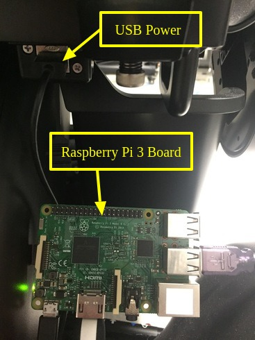
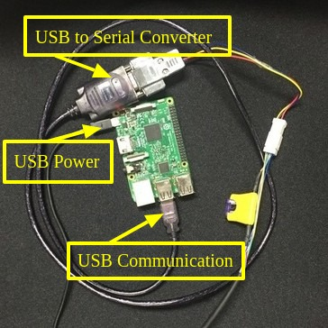

# whillpy
Unofficial python package for WHILL Model CK control


## Dependencies
1. Python 2 or 3
1. [pyserial](https://pythonhosted.org/pyserial)
    * ~It can easily be installed using pip i.e., `pip install pyserial`~ *(it will be installed automatically)*

## Installation Steps
There are many ways to install `whillpy`. Please choose an option from below-
1. Install using pip
      * `pip install whillpy`
1. Install using conda
      * `conda install -c ravijoshi whillpy`
1. Install from source
      1. Clone or download the repository
      1. Use the following command `python setup.py install`
            * Alternatively the package can be installed to a user directory using the following command
```
python setup.py install --user
```

## Connection Diagram
In order to control WHILL Model CK, we propose to use Raspberry Pi 3 module. This module can easily be powered up by the provided USB socket in WHILL. Below are the connection diagrams -

**Power**



**Connections**



## Usage
Below is an example-

```
import whillpy

# initialize Whill by providing the name of the serial port
whill = whillpy.connect(port='/dev/ttyUSB0')

# control the power
whill.set_power(whillpy.power.on)

# move straight while turning left
whill.move(straight=10, turn=-50)
```
Examples can be found in [examples](examples) directory of this package.

## Issues
Please check [here](https://github.com/ShibataLab/whillpy/issues) and create issues.

## Errors
While executing whillpy, if the following error is encountered:
```
[ERROR] could not open port /dev/ttyUSB0: [Errno 13] Permission denied: '/dev/ttyUSB0'
```
Please execute the following:
```
sudo chmod 666 /dev/ttyUSB0
```

## Author
[Ravi Prakash Joshi](https://ravijo.github.io/)
